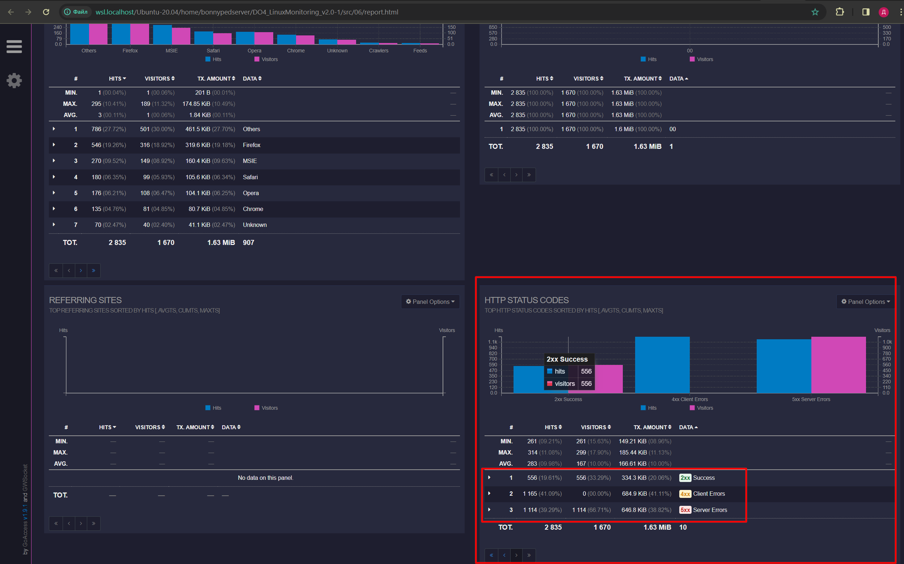
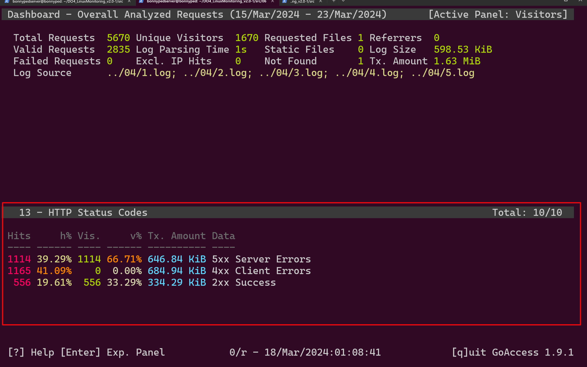
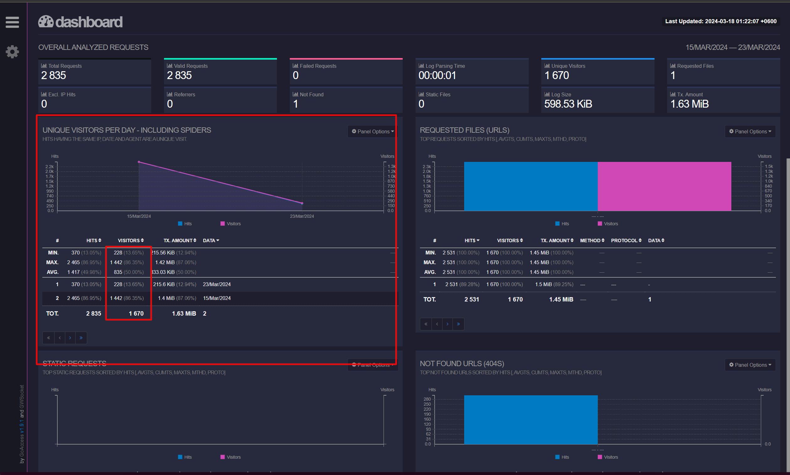
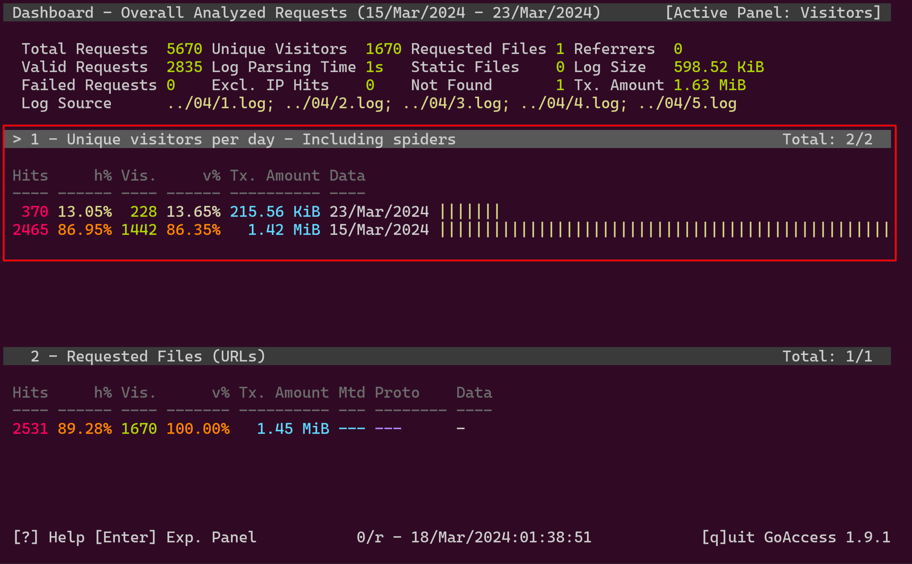
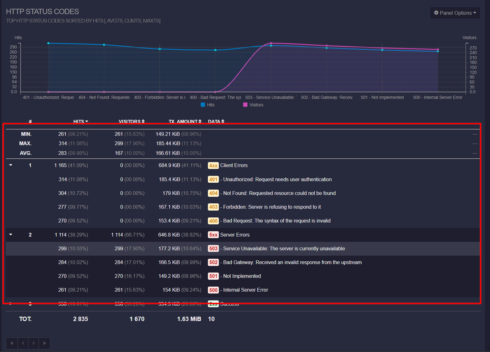
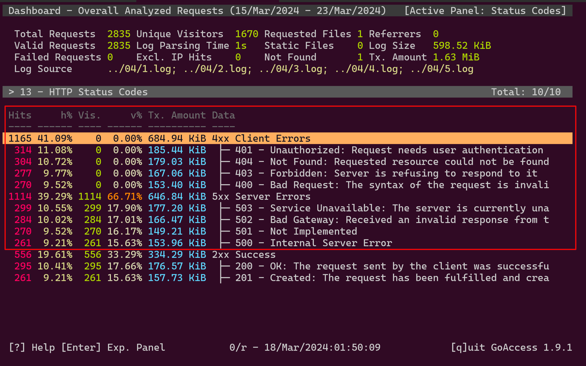

# Goaccess
- фильтрую по коду ответа в веб версии командой

_goaccess -f ../04/*.log --sort-panel=STATUS_CODES,BY_DATA,ASC --log-format=COMBINED -o report.html_

- в терминале командой (сортировка намеренно выбрана в обратную сторону)

_goaccess -f ../04/*.log --sort-panel=STATUS_CODES,BY_DATA,DESC_

___
- все уникальные ip

_goaccess -f ../04/*.log --log-format=
COMBINED -o report.html_

_goaccess -f ../04/*.log_

___

- просмотр только кодов с ошибкой

- в терминале

![в терминале]

___

