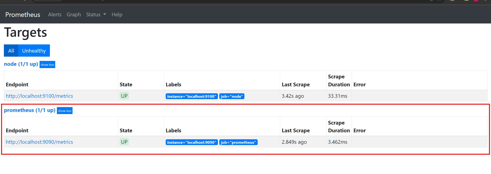

# Prometeus & Grafana

- установил Prometeus

_sudo apt install prometheus_

- установил  Grafana

_sudo snap install grafana_

- запустил Prometeus

- проверяю, что Prometeus собирает данные

- установил и запустил Grafana

- установил и запустил prometheus-node-exporter.service

- получен доступ к Прометеус на локальном компьютере

- получен доступ к Графана на локальном компьютере

- добавил метрики в Дашборд Графана

- запускаю скрипт из парт 2

- проверьте загрузку жесткого диска и не только

- утсанавливаю утилиту стресс

- состояние системы до запуска утилиты

- запуск стресс

- состояние система в процессе стресс

