# Part 8 Готовый дашборд

- устанвливаю готовый дашборд
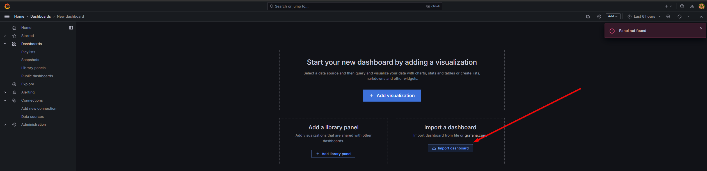
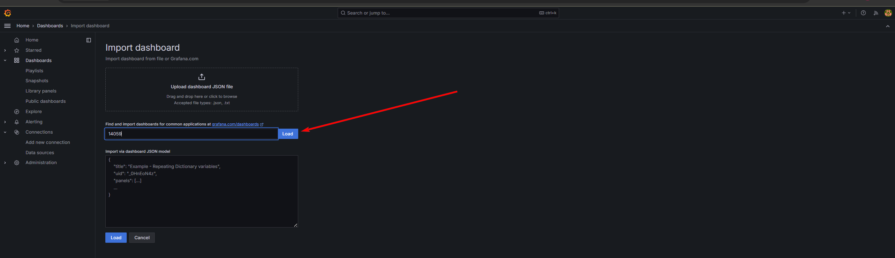
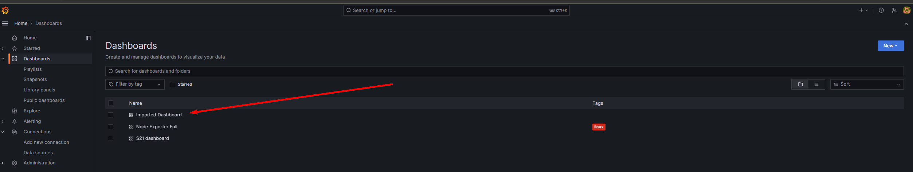
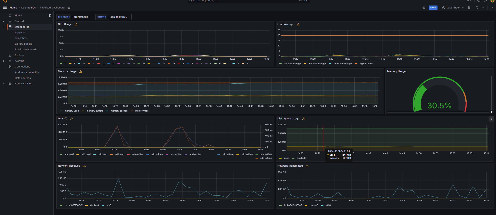

- запускаю скрипт из Парт 2
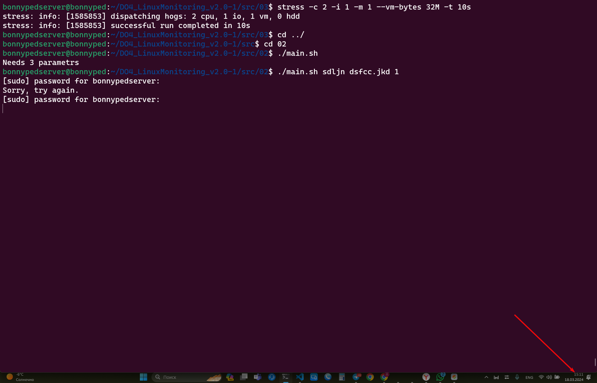

- проверяю состояние системы в дашборде
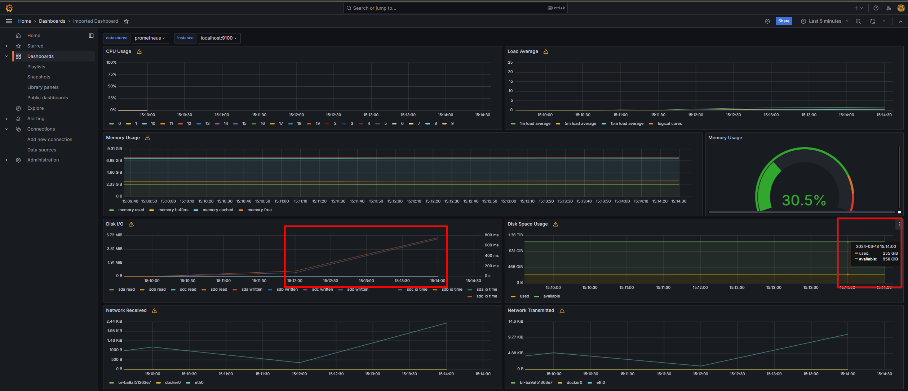
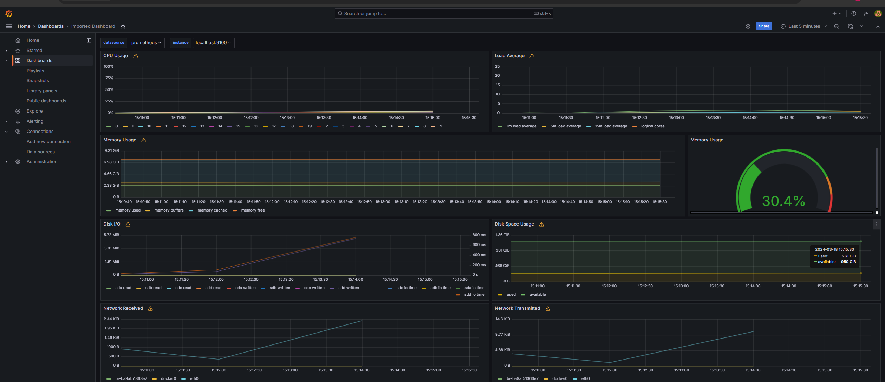

- запускаю утилиту стресс
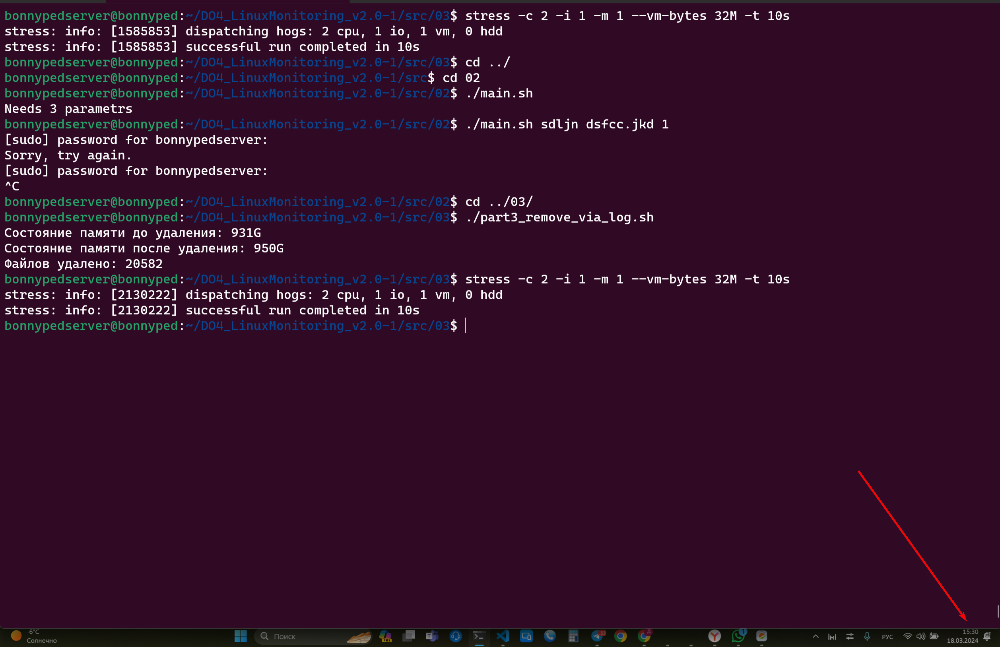

- проверяю состояние системы в дашборде
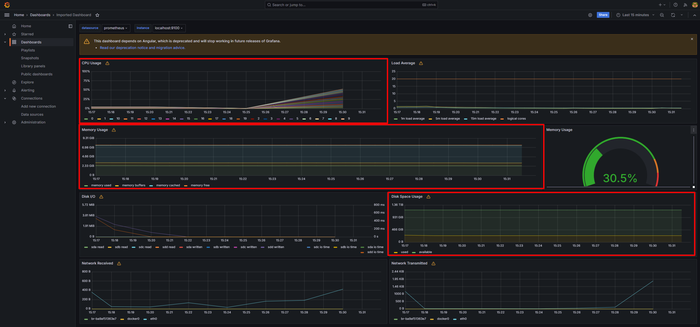

- Запускаю тестсетевой нагрузки Iperf3
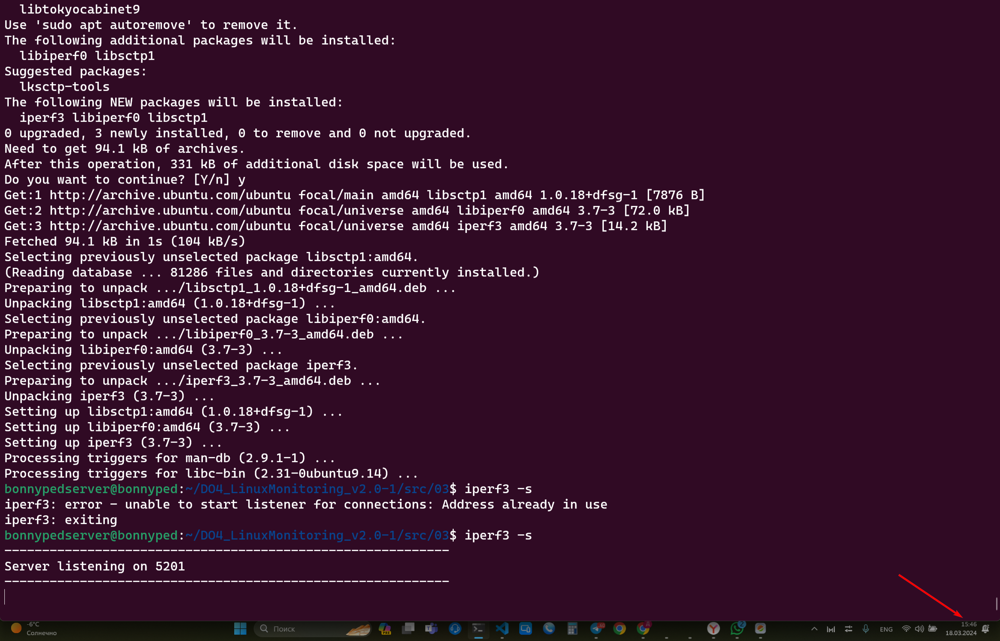

- проверяю состояние системы в дашборде
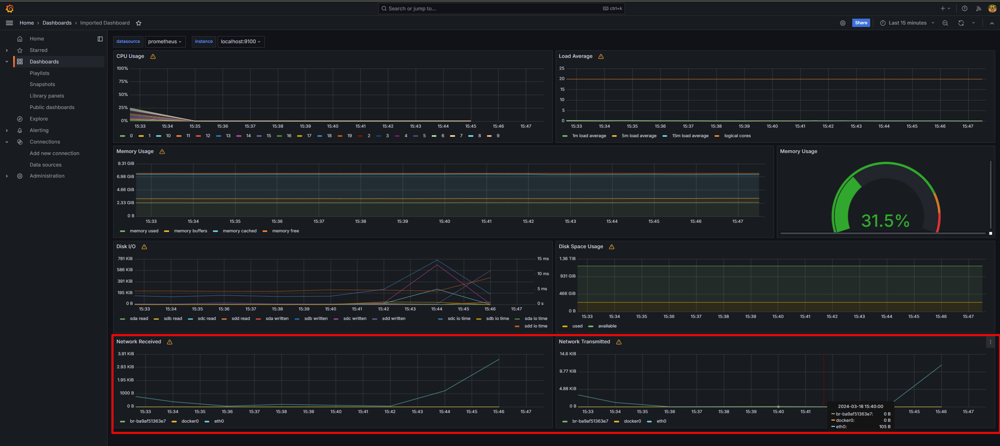

- Отключаю тест сетевой нагрузки Iperf3
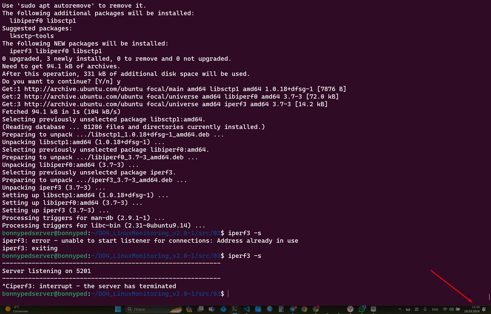

- проверяю состояние системы в дашборде

